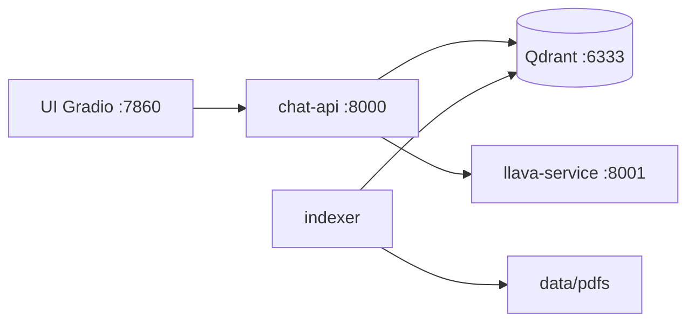

# ProyectoAgenteIAFormacion

Agente RAG local con recuperación semántica, citación y despliegue en contenedores.

Este repositorio contiene un agente de Inteligencia Artificial basado en la técnica **Retrieval-Augmented Generation (RAG)**, diseñado para trabajar **en local** con documentos propios. El sistema permite realizar consultas en lenguaje natural sobre una colección de documentos (PDF y DOCX), recuperando fragmentos relevantes mediante búsqueda vectorial y generando respuestas apoyadas en evidencias verificables.

---

## Características principales

- Indexación automática de documentos locales (PDF y DOCX).
- `doc_id` determinista (uuid5 sobre sha256 del contenido): la reindexación es idempotente.
- Extracción de metadatos del fichero (autor, fechas, idioma) durante la indexación.
- Chunking estructural que respeta páginas/párrafos en lugar de cortar arbitrariamente.
- Búsqueda semántica mediante embeddings y k-NN sobre Qdrant.
- Re-ranking por MMR para diversificar resultados.
- Filtros por subcarpeta (`folder`) y tipo de documento (`doc_type`) en `/chat`.
- Modo estricto: si no hay evidencia por encima del umbral, **no se llama al LLM** y se devuelve un mensaje claro.
- Generación de respuestas con citas y fragmentos de evidencia.
- Gestión de sesiones con memoria conversacional y TTL.
- Detección automática del idioma de la consulta (es/en) para alinear la respuesta.
- Interfaz web local mediante Gradio.
- Fallback controlado a URLs oficiales predefinidas (solo se muestra cuando no hay documentos relevantes).
- Despliegue reproducible con Podman Compose (compatible con Docker Compose).

---

## Arquitectura

El sistema se compone de cinco servicios orquestados con `podman-compose.yml`:



| Servicio        | Puerto | Rol |
| --------------- | ------ | --- |
| `ui`            | 7860   | Interfaz Gradio para el usuario final |
| `chat-api`      | 8000   | API REST: búsqueda, memoria, citas |
| `llava-service` | 8001   | Inferencia del modelo LLM local (GGUF) |
| `qdrant`        | 6333   | Base de datos vectorial |
| `indexer`       | —      | Genera metadatos e indexa documentos al arrancar |

---

## Requisitos

### Software

- Git
- Podman y Podman Compose (`podman-compose`), **o** Docker y Docker Compose
- En Windows: [Podman Desktop](https://podman.io/docs/installation) o Docker Desktop con backend WSL2

> El proyecto usa `Containerfile*` (convención Podman). Con Docker Compose basta sustituir mentalmente por `Dockerfile` o usar `docker compose` apuntando al mismo `podman-compose.yml`.

### Hardware

- CPU moderna
- Memoria suficiente para el modelo LLM local (recomendado >= 8 GB de RAM; el servicio LLaVA tiene límite por defecto de 4 GB)
- GPU no obligatoria (depende del modelo GGUF elegido)

---

## Estructura del repositorio

```
ProyectoAgenteIAFormacion/
├── src/
│   ├── catalog/              # Indexación: metadata_extractor, text_extractor
│   ├── service/              # chat_api.py, llm_service.py
│   ├── ui/                   # ui_app.py (Gradio)
│   └── mem/                  # Memoria conversacional (SQLite)
├── data/
│   └── pdfs/                 # Tus PDF/DOCX (no se versionan)
├── models/
│   ├── all-MiniLM-L6-v2/     # Modelo de embeddings (descargar)
│   └── llava/
│       └── ggml-model-q4_k.gguf
├── requirements/             # Dependencias por servicio
├── tests/                    # Suite de tests unitarios
├── Containerfile             # Imagen llava-service
├── Containerfile.api         # Imagen chat-api
├── Containerfile.indexer     # Imagen indexer
├── Containerfile.ui          # Imagen ui
├── podman-compose.yml
├── official_urls.json        # URLs curadas para fallback
├── metadata_master_1.json    # Generado en runtime (ver preparación)
├── .env.example              # Plantilla de configuración
└── .env                      # (opcional) overrides locales
```

---

## Preparación antes del primer arranque

### 1. Clonar el repositorio

```bash
git clone https://github.com/Xavidem/ProyectoAgenteIAFormacion.git
cd ProyectoAgenteIAFormacion
```

### 2. Estructura inicial del repositorio

El repositorio ya incluye las carpetas y ficheros base necesarios para el primer arranque:

- `data/pdfs/` — coloca aquí tus PDF/DOCX
- `models/all-MiniLM-L6-v2/` y `models/llava/` — descarga los modelos (ver paso 3)
- `metadata_master_1.json` — catálogo vacío `[]` que el indexador regenera al arrancar

Si clonas en un entorno donde falte `metadata_master_1.json`, créalo a partir de la plantilla:

```bash
cp metadata_master_1.json.example metadata_master_1.json
```

En Windows (PowerShell): `Copy-Item metadata_master_1.json.example metadata_master_1.json`

### 3. Descargar modelos

**Embeddings** — descarga [all-MiniLM-L6-v2](https://huggingface.co/sentence-transformers/all-MiniLM-L6-v2) y colócalo en `models/all-MiniLM-L6-v2/`.

**LLM (LLaVA)** — descarga un modelo GGUF, por ejemplo [ggml-model-q4_k.gguf](https://huggingface.co/mys/ggml_llava-v1.5-7b/blob/main/ggml-model-q4_k.gguf), en `models/llava/ggml-model-q4_k.gguf`.

### 4. Añadir documentos

Copia tus PDF y DOCX en `data/pdfs/`. Puedes usar subcarpetas; el campo `folder` de la API filtra por ellas.

### 5. (Opcional) Configurar variables de entorno

```bash
cp .env.example .env
```

En Windows (PowerShell): `Copy-Item .env.example .env`

Ajusta rutas, límites de memoria/CPU y parámetros de búsqueda según tu máquina.

---

## Cómo levantar el proyecto

Desde la raíz del repositorio:

```bash
podman-compose up --build
```

Con Docker Compose:

```bash
docker compose -f podman-compose.yml up --build
```

El primer arranque puede tardar varios minutos (descarga de imágenes base, compilación de LLaVA, carga del modelo GGUF). Espera a que los healthchecks de `qdrant`, `llava-service`, `chat-api` y `ui` estén en verde.

### Servicios disponibles

| URL | Descripción |
| --- | ----------- |
| http://localhost:7860 | Interfaz web (Gradio) |
| http://localhost:8000 | API backend (`/chat`, `/health`, …) |
| http://localhost:8001 | Servicio LLaVA (`/infer`, `/health`) |
| http://localhost:6333 | Qdrant (dashboard y API vectorial) |

La indexación se ejecuta automáticamente al arrancar el contenedor `indexer` y es **idempotente**: si un documento ya está indexado y su contenido no ha cambiado (mismo sha256), no se vuelve a procesar.

---

## Operación diaria

### Consultar desde la interfaz web

1. Abre http://localhost:7860
2. Ajusta **k** (documentos a recuperar, 1–10) y **threshold** (score mínimo de similitud, 0.0–1.0)
3. Escribe una pregunta en lenguaje natural
4. Revisa la respuesta, los documentos citados y los fragmentos de evidencia
5. Si no hay documentos relevantes, verás el mensaje de “sin evidencia” y, si aplica, URLs del fallback

### Consultar desde la API

```bash
curl -s -X POST http://localhost:8000/chat \
  -H "Content-Type: application/json" \
  -d '{"query": "¿Qué es Podman?", "k": 5, "threshold": 0.4}'
```

Parámetros opcionales: `session_id`, `folder` (subcarpeta de `data/pdfs`), `doc_type` (`pdf` o `docx`).

### Ver logs

```bash
podman-compose logs -f chat-api
podman-compose logs -f indexer
podman-compose logs -f llava-service
```

### Parar el sistema

```bash
podman-compose down
```

Para eliminar también el volumen de Qdrant (reindexación completa la próxima vez):

```bash
podman-compose down -v
```

### Reindexar tras añadir o modificar documentos

Reinicia solo el indexador:

```bash
podman-compose restart indexer
```

O levanta de nuevo el servicio:

```bash
podman-compose up -d indexer
```

---

## Fallback a URLs oficiales

El sistema **no navega por la web abierta**. Cuando una consulta coincide con keywords de un tema definido en `official_urls.json`, se muestran enlaces curados. Solo aparecen cuando **no hay documentos relevantes** por encima del umbral.

Edita `official_urls.json` para adaptar dominios y fuentes autorizadas a tu contexto.

---

## Variables de entorno principales

Copia `.env.example` a `.env` o define las variables en `podman-compose.yml`.

| Servicio | Variable | Descripción |
| -------- | -------- | ----------- |
| Todos | `LOG_LEVEL` | `DEBUG` / `INFO` / `WARNING` / `ERROR` |
| Host | `DATA_ROOT` | Ruta de documentos (`./data/pdfs`) |
| Host | `MODELS_ROOT` | Ruta de modelos (`./models`) |
| Host | `EMBEDDINGS_DIR` | Subcarpeta del modelo de embeddings |
| Host | `LLAVA_DIR` / `LLAVA_MODEL_FILE` | Ruta y nombre del GGUF |
| Indexer | `QDRANT_COLLECTION_NAME` | Nombre de la colección (default `docs`) |
| Indexer | `CHUNK_SIZE` / `CHUNK_STRIDE` | Parámetros de chunking |
| Indexer | `STRUCTURAL_CHUNKING` | `1` = respeta páginas/párrafos |
| LLaVA | `LLAVA_N_CTX` | Tamaño de contexto (default 1024) |
| LLaVA | `LLAVA_N_THREADS` / `LLAVA_N_BATCH` | Hilos y batch de inferencia |
| API | `SEARCH_MULTIPLIER` | Candidatos = k × multiplicador |
| API | `MMR_LAMBDA` | λ de MMR (1.0 = relevancia, 0.0 = diversidad) |
| API | `ALLOW_MULTI_CHUNK` / `MULTI_CHUNK_RATIO` | Hasta 2 chunks por documento |
| API | `MEMORY_TTL_DAYS` / `MEMORY_MAX_TURNS` | TTL y turnos de memoria |
| API | `PROMPT_CHAR_BUDGET` | Límite de caracteres del prompt |
| API | `LLAVA_MAX_TOKENS_CHAT` / `LLAVA_MAX_TOKENS_SUMMARY` | Tokens máx. respuesta y resumen |
| API | `OFFICIAL_LINKS_PATH` | Ruta de `official_urls.json` |
| API | `CORS_ORIGINS` | `*` o lista CSV de orígenes |
| API | `REINDEX_COMMAND` | Comando shell para `/admin/reindex` |
| UI | `BACKEND_URL` | URL del endpoint `/chat` |
| UI | `FILES_PUBLIC_BASE` | Base pública para enlaces a `/files/{doc_id}` |
| UI | `UI_DEFAULT_THRESHOLD` / `UI_DEFAULT_K` | Valores por defecto de los sliders |

Límites de recursos (`*_MEM_LIMIT`, `*_CPUS`) también se configuran en `.env.example`.

---

## Endpoints principales de la API

| Método | Ruta | Descripción |
| ------ | ---- | ----------- |
| `POST` | `/chat` | Consulta principal |
| `GET` | `/files/{doc_id}` | Descarga del documento original |
| `POST` | `/session/start` | Inicia o recupera sesión |
| `POST` | `/session/clear` | Limpia historial de una sesión |
| `POST` | `/session/cleanup` | Elimina sesiones caducadas (TTL) |
| `GET` | `/health` | Estado del servicio (incluye `llava: ok\|nok`) |
| `GET` | `/admin/stats` | Documentos y chunks indexados |
| `POST` | `/admin/reindex` | Reindexación en background (requiere `REINDEX_COMMAND`) |

### Comportamiento de `/chat`

1. Embebe la consulta y busca `k × SEARCH_MULTIPLIER` candidatos en Qdrant (filtros opcionales `folder` / `doc_type`).
2. Aplica MMR cuando `MMR_LAMBDA < 1.0` para diversificar resultados.
3. Consolida por documento. Con `ALLOW_MULTI_CHUNK=true` permite hasta 2 chunks del mismo documento si el segundo score ≥ `MULTI_CHUNK_RATIO × mejor`.
4. **Sin evidencia por encima del umbral**: devuelve un mensaje fijo sin llamar al LLM y muestra URLs del fallback si aplican.
5. **Con evidencia**: construye un prompt estricto que obliga al LLM a responder solo con la evidencia recuperada.

---

## Tests

El proyecto incluye **98 tests unitarios** bajo `tests/`. Para ejecutarlos en local:

```bash
python -m venv .venv
# Linux/macOS:  source .venv/bin/activate
# Windows:      .venv\Scripts\Activate.ps1
pip install -r requirements/requirements.api.txt httpx
python -m unittest discover -t . -s tests -v
```

Los tests usan stubs para dependencias pesadas (sentence-transformers, qdrant-client, pymupdf, python-docx, langdetect, gradio), de modo que **no requieren modelos ni Qdrant en ejecución**. Sí necesitan `fastapi`, `pydantic`, `pydantic-settings`, `requests` y `httpx`.

---

## Solución de problemas

| Síntoma | Posible causa | Qué hacer |
| ------- | ------------- | --------- |
| Fallo en `COPY metadata_master_1.json` al build | Fichero inexistente | `cp metadata_master_1.json.example metadata_master_1.json` |
| `llava-service` no pasa healthcheck | Modelo GGUF ausente o ruta incorrecta | Verificar `models/llava/ggml-model-q4_k.gguf` y variables `LLAVA_*` |
| Respuestas vacías o sin documentos | Índice vacío o threshold alto | Comprobar logs del `indexer`, bajar `threshold`, revisar `/admin/stats` |
| UI no conecta al backend | `chat-api` aún no healthy | `podman-compose logs chat-api` y esperar al healthcheck |
| Permisos en volúmenes (SELinux) | Flags `:Z` de Podman | En Docker puro, quitar el sufijo `:Z` de los volúmenes en el compose |
| `/admin/reindex` devuelve 503 | `REINDEX_COMMAND` vacío | Definir un comando en `.env` o reiniciar el contenedor `indexer` manualmente |

---

## FAQ

**¿Dónde coloco mis documentos?**
En `data/pdfs/`. Solo se indexan PDF y DOCX.

**¿Cómo levanto todo?**
`podman-compose up --build` desde la raíz del proyecto.

**¿Debo ejecutar el indexador a mano?**
No. Se lanza al arrancar y queda en espera tras indexar.

**¿Qué pasa si cambio o añado documentos?**
Reinicia el indexador: `podman-compose restart indexer`.

**¿Necesito internet?**
No en runtime, salvo para la descarga inicial de modelos e imágenes.

**¿Puedo usar Docker en vez de Podman?**
Sí. Usa `docker compose -f podman-compose.yml up --build`. En entornos sin SELinux, elimina `:Z` de los volúmenes si da problemas.

---

## Autor

Javier Vals López  
Ingeniero informático — Universidad Politécnica de Madrid (UPM Montegancedo)  
Trabajo de Fin de Grado — Agente RAG local
